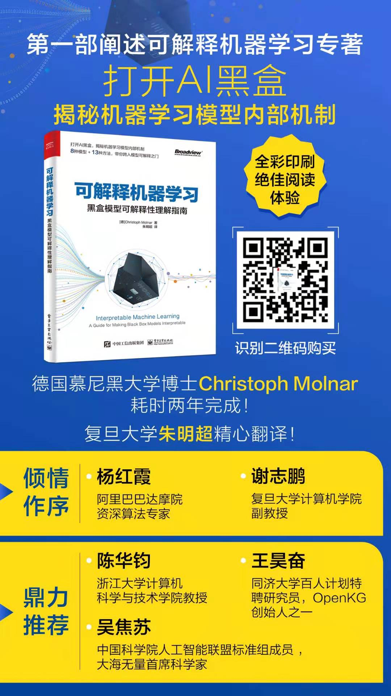
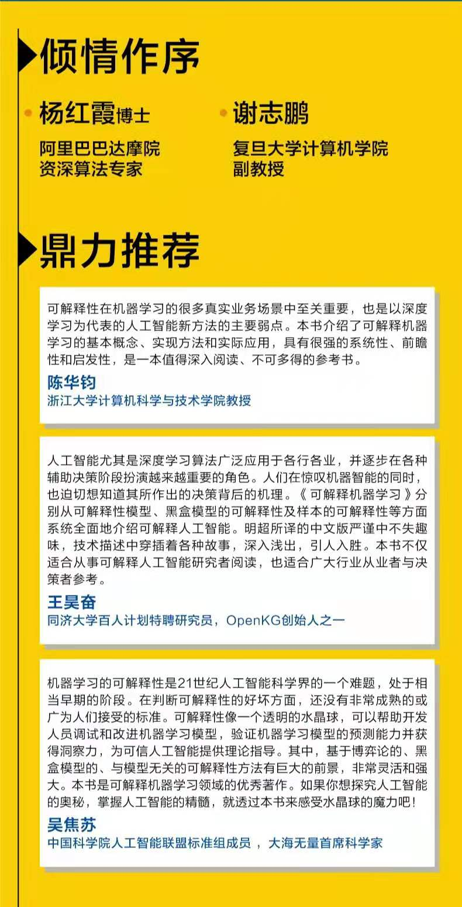
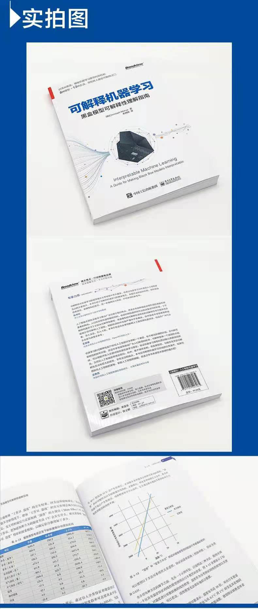

《可解释机器学习--黑盒模型可解释性理解指南》
---
该书为《Interpretable Machine Learning》中文版，《Interpretable Machine Learning》是可解释性领域内的第一本著作，深受可解释机器学习研究者的喜爱，并被FloydHub评定为2020年世界最佳机器学习著作之一。该书原作者是 Christoph Molnar，他是一名数据科学家和可解释机器学习博士 @christophM。英文版的项目 [地址](https://christophm.github.io/interpretable-ml-book/index.html)，这是一个很棒的工作，易于理解和实战参考。

我是 朱明超。关于此书的译本，我在翻译后进行了校正。

我不是专职翻译，而且水平有限，无法消除众多读者的方差。如果你在阅读过程中有遇到任何问题，可以在 Issues 或者通过邮箱联系我 (邮箱联系方式见后文)。你可以在 releases 中下载中英版。如果后面时间允许的话，我会为这本书描述的方法，补充基于 Python 的实战应用。

## 出版读物 (后续)

在将本书放到GitHub上之后，便被很多公众号和媒体转载，并且上了GitHub热搜榜首，在此我由衷感谢。

随着机器学习与人工智能的研究不断取得突破性进展，然而高性能的复杂算法、模型及系统普遍缺乏决策逻辑的透明度和结果的可解释性，导致在涉及需要做出关键决策判断的国防、金融、医疗、法律、网络安全等领域中，或要求决策合规的应用中，机器学习技术及系统难以大范围应用。因此，我们亟须找到方法去解释这些模型，建立人与模型之间的信任。这便是可解释性如此重要的原因。

尽管可解释性的重要性不言而喻，但相关书籍却一直空缺。《Interpretable Machine Learning》是少有的系统性地整理可解释性工作的图书。书中每节介绍一种解释方法，既通过通俗易懂的语言直观地描述这种方法，也通过数学公式详细地介绍方法的理论，无论是对技术从业者还是对研究人员均大有裨益。同时，书中将每种方法都在真实数据上进行了测试，我认为这是本书最大的特色，因为只有将方法落实到数据上进行实验，才能让人们真正理解这种方法。最后，书中对每种方法的优缺点都做了批判性讨论，这同样是非常值得阅读的地方。这本书的实用性确实很强！

我看到这本书的原文后，觉得值得花时间精力去翻译，不仅因为可解释性领域的重要性以及它是第一本相关图书，而且因为它符合我对好书的定义。我认为一本好书既能让知识传递，又能让读者读完后豁然开朗。从那之后，我便开始专注于译本，翻译过程耗时很久。我沉浸于此书的译本，既是因为可解释性是我研究和喜欢的领域，也是因为我热爱这件事， 我喜欢将自己的时间和精力都专注在自己热爱的事情上。

电子工业出版社博文视点联系我和Molnar，想将本书正式出版，填补国内在可解释性领域书籍的空白。后来，在校对译稿的过程中，宋亚东编辑帮助了我，他的热情和敬业真的感染了我。他和其他学者对译稿进行了全面细致的校对，提出了极多宝贵的意见，在此表示由衷的感谢。修改后的版本和放在GitHub上的最初版本有很大出入。同时，感谢陈华钧、王昊奋、吴焦苏等老师做的推荐。

本书将由电子工业出版社正式打印出版，可于博文视点官网http://www.broadview.com.cn/搜索 [可解释机器学习](http://www.broadview.com.cn/book/6530) ，或者在官方销售网站上购买。感谢您的推荐和支持，在此不甚感激！

最后，因为出版社的要求，我知乎上创建的账号：[朱明超](https://www.zhihu.com/people/zhu-ming-chao-99-36)。包括隔壁下次更新会直接更完的花书全书的原理与代码实现的项目，《可解释机器学习》的后续版本，以及今后会写的内容，会在知乎上说，感谢关注！

## 面向读者

建议机器学习从业者、数据科学家、统计学家和任何对使机器学习模型可解释的⼈阅读本书。

如果你是机器学习初学者，建议学习基础知识。关于机器学习的⼊门学习，我推荐 Andrew Ng 的 [“机器学习” 在线课程](https://www.coursera.org/learn/machine-learning)。如果你是对机器学习或深度学习的原理感兴趣，我也推荐另一个 [项目](https://github.com/MingchaoZhu/DeepLearning)，该项目描述其原理和代码实现过程。 

## 章节介绍

这本书的重点是机器学习的可解释性。你将学习简单的、可解释的模型，如线性回归、决策树和决策规则等。后面几章重点介绍了解释黑盒模型的模型无关的一般方法，如特征重要性和累积局部效应，以及用 Shapley 值和 LIME 解释单个实例预测。

对各种解释方法进行了深入的解释和批判性的讨论。它们是如何工作的？优点和缺点是什么？如何解释它们的输出？本书将使你能够选择并正确应⽤最适合你的机器学习项⽬的解释⽅法。你阅读本书后，内化基础知识还使你能够更好地理解和评估 arxiv.org 上发表的有关可解释性的新论⽂。

第一版《可解释的机器学习》总共包含 7 章内容。章节目录如下：

+ 第一章：前言

+ 第二章：可解释性

+ 第三章：数据集

+ 第四章：可解释的模型

+ 第五章：模型无关方法

+ 第六章：基于样本的解释

+ 第七章：水晶球

## 联系作者

我的邮箱联系方式为 [deityrayleigh@gmail.com](mailto:deityrayleigh@gmail.com)

如果你遇到任何问题，可以通过邮箱联系我。

同样，你可以通过邮箱联系 Christoph Molnar: [christoph.molnar.ai@gmail.com](mailto:christoph.molnar.ai@gmail.com)

你可以在 leanpub.com 或 lulu.com 上购买英文书的电子版和纸质版。

感谢作者 Christoph Molnar 的支持：https://twitter.com/ChristophMolnar/status/1253657782269739008?s=20

感谢 刘蕊 @KaMAo112的帮助。

## 致谢

感谢对本项目的认可与推广：

+ 量子位：https://mp.weixin.qq.com/s/RmpPs3VQj-OmB3bSbbMg0w
+ 专知：https://mp.weixin.qq.com/s/jkNs6LXxxbVT9ybKO8RpLg
+ GitHubDaily：https://zhuanlan.zhihu.com/p/139738569
+ 量化投资与机器学习：https://mp.weixin.qq.com/s/stEuhtIk8bBOiDu0x1OtFw
+ AI有道：https://mp.weixin.qq.com/s/fa3EapLul1QYYesZ2ISo2g
+ 极市平台：https://mp.weixin.qq.com/s/JoBlCABnhzM09Wb5YREZiA
+ 计算机视觉life：https://mp.weixin.qq.com/s/0IqzJqU2HjIzCwqcvlx_Cw
